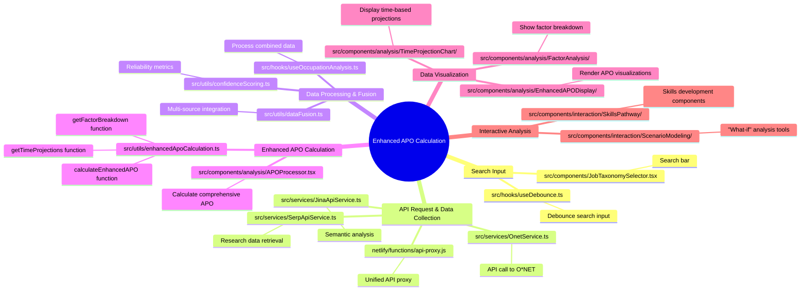

# Enhanced APO Calculation System: AI-Driven Approach

A mindmap process flow that illustrates how the final APO% is calculated using SerpAPI and JinaAPI integration, including the relevant file names and the data flow from the search engine to the final outcome.

## Enhanced Process Flow

1. **Search Input**
   - File: `src/components/JobTaxonomySelector.tsx`
   - The user enters a search term in the search bar.
   - File: `src/hooks/useDebounce.ts`
   - The search input is debounced to prevent excessive API calls.

2. **API Request & Data Collection**
   - File: `src/services/OnetService.ts`
   - An API call is made to the O*NET database for occupation details.
   - File: `src/services/SerpApiService.ts`
   - SerpAPI is queried for current research on automation potential.
   - File: `src/services/JinaApiService.ts`
   - JinaAPI performs semantic analysis on occupation descriptions and tasks.
   - File: `netlify/functions/api-proxy.js`
   - The Netlify function acts as a unified proxy for all external APIs.

3. **Data Processing & Fusion**
   - File: `src/utils/dataFusion.ts`
   - Multiple data sources are integrated with weighted importance.
   - File: `src/utils/confidenceScoring.ts`
   - Reliability metrics are calculated based on data source agreement.
   - File: `src/hooks/useOccupationAnalysis.ts`
   - The combined data is processed and prepared for APO calculation.

4. **Enhanced APO Calculation**
   - File: `src/utils/enhancedApoCalculation.ts`
   - The `calculateEnhancedAPO` function applies ML-driven factor weighting.
   - The `getTimeProjections` function generates 2, 5, and 10-year forecasts.
   - The `getFactorBreakdown` function analyzes contributing factors.
   - File: `src/components/analysis/APOProcessor.tsx`
   - A comprehensive APO assessment is calculated with confidence intervals.

5. **Data Visualization**
   - File: `src/components/analysis/EnhancedAPODisplay/`
   - Enhanced APO visualizations are rendered with confidence indicators.
   - File: `src/components/analysis/TimeProjectionChart/`
   - Time-based projections are displayed with key driving factors.
   - File: `src/components/analysis/FactorAnalysis/`
   - Detailed factor breakdown is presented with relative importance.

6. **Interactive Analysis**
   - File: `src/components/interaction/ScenarioModeling/`
   - Users can explore "what-if" scenarios with different parameters.
   - File: `src/components/interaction/SkillsPathway/`
   - Personalized skill development recommendations are provided.

## Data Flow

1. User enters a search term in `JobTaxonomySelector.tsx`
2. The search term is debounced in `useDebounce.ts`
3. `useOccupationAnalysis.ts` triggers parallel API calls:
   - O*NET data via `OnetService.ts`
   - Research data via `SerpApiService.ts`
   - Semantic analysis via `JinaApiService.ts`
4. API requests are proxied through `api-proxy.js` Netlify function
5. `dataFusion.ts` integrates multiple data sources with confidence scoring
6. `enhancedApoCalculation.ts` functions calculate comprehensive APO metrics
7. `APOProcessor.tsx` generates the final APO assessment with projections
8. Visualization components render the results with interactive elements
9. Users can explore scenarios and receive personalized recommendations

This enhanced process ensures that the APO calculation is based on the latest research data, semantic analysis, and O*NET information, providing a comprehensive and forward-looking assessment of automation potential.
